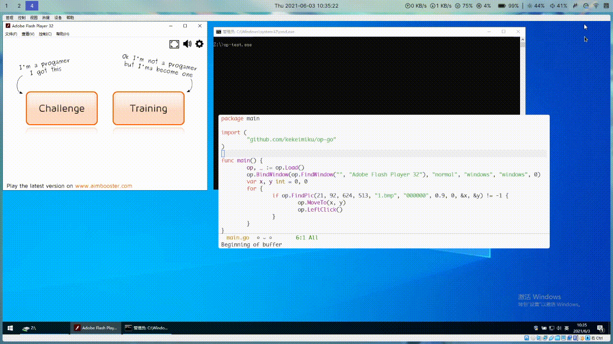

# WIP 活跃开发中...

- [x] 实现op所有的方法调用 截至2021-06-03 op wiki中所有提到的接口都已实现
- [ ] 详细简洁的注释文档 
- [ ] 一键打包所有静态文件
- [ ] 包含基本功能的图形界面api

# 使用

go get github.com/kekeimiku/op-go

# 例子

```go
package main

import (
	"fmt"
	"github.com/kekeimiku/op-go"
)

func main() {
	op, _ := op.Load()
	fmt.Println("当前版本", op.Ver())
}
```

一个低配版后台鼠标模式的“自瞄”小游戏例子


视频里的小游戏是 http://www.aimbooster.com/
